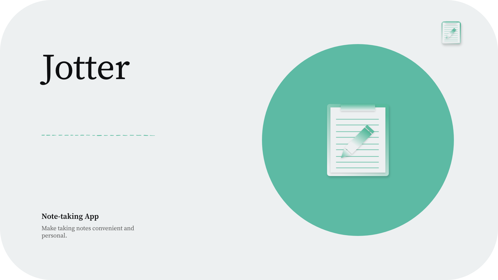
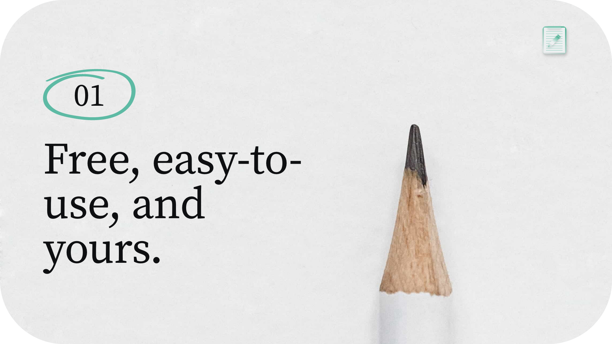
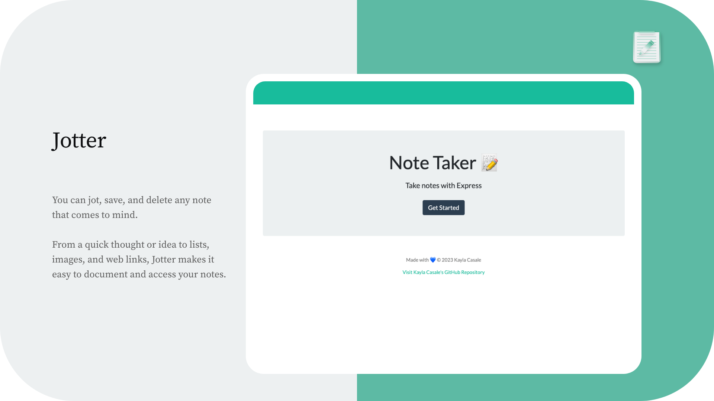
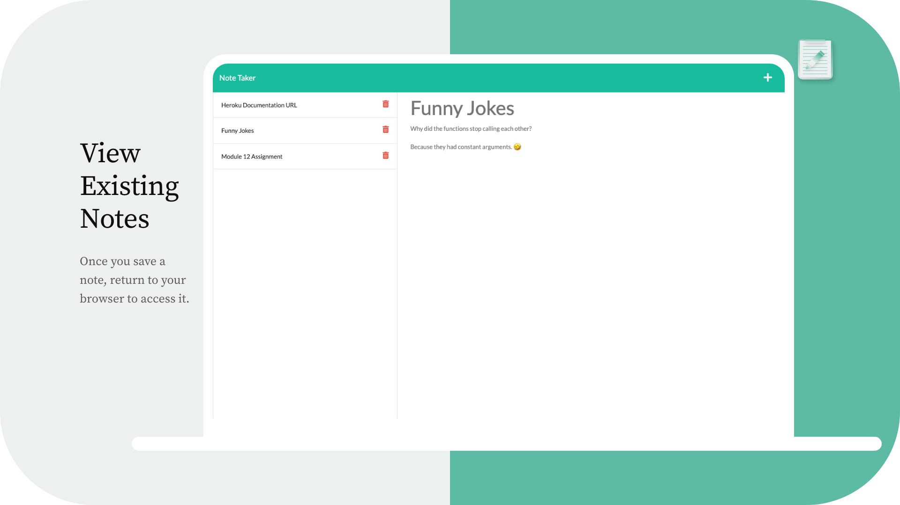
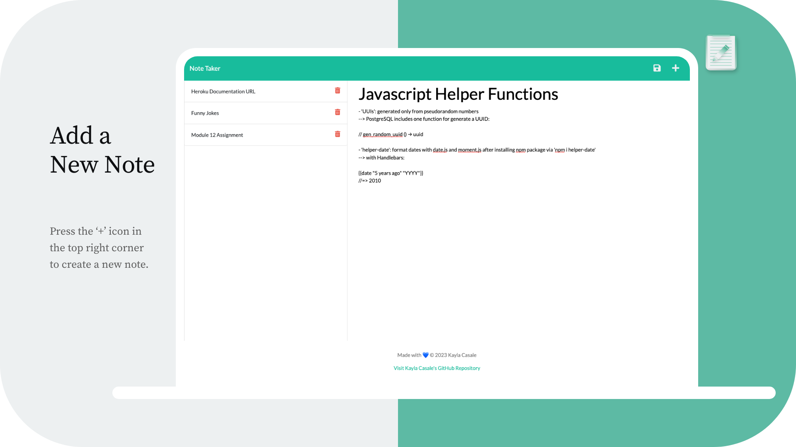
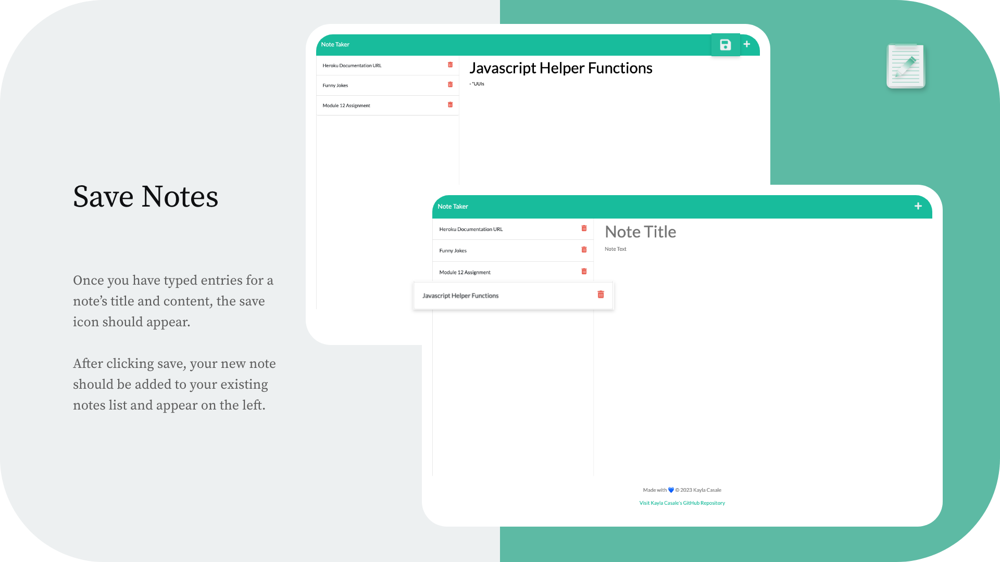
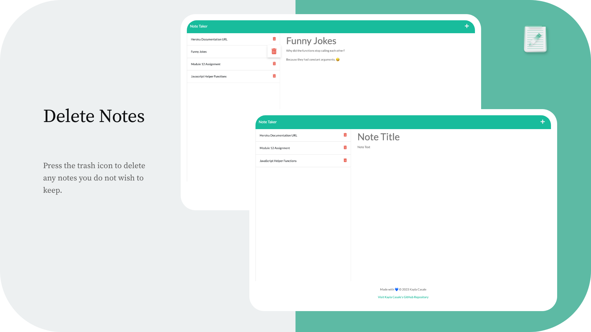
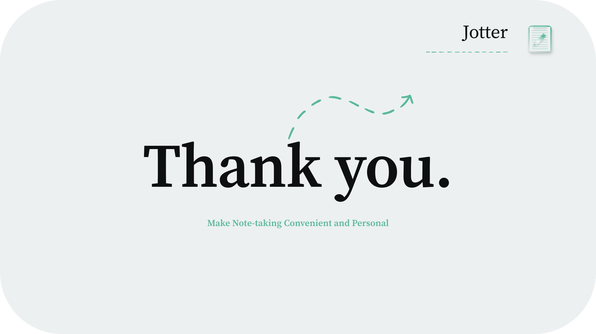

# Note Taker App 📝
An free, easy-to-use, and convenient application to write and save your notes on your browser.

## jotter
You can jot, save, and delete any note that comes to mind. From a quick thought or idea to lists, images, and web links, Jotter makes it easy to document and access your notes.

## Table of Contents
* [Description](#description)
* [Usage](#usage)
* [Deck](#deck)
* [Visual Wireframe](#visual-wireframe)
* [Mockup](#mockup)
* [Built With](#built-with)
* [Mockup](#mockup)
* [Focus Points](#focus-points)
* [Deck](#deck)

## Description
This online application allows users to easily create, access, discard and share notes with others who have the same link and from any device. 

You must have Node.js to install the npm package and require Express.js using CLI.

## Usage

**Link to Deployed Application**: https://jotter-notetakerapp.herokuapp.com/

<!-- ## Installation
1. To clone this repository to your local device:
> Enter `git clone <URL>` into the command-line

2. To install necessary packages:
> Enter `npm i` into the command-line

## Usage
Once the repository has been cloned locally and all packages have been installed, open your command-line, making sure you `cd` to the correct directory that holds your code.

3. To initialize the application, enter the following command into the command-line:
> `node server.js`

The Jotter application should respond:
`Jotter app listening at 'http://localhost:3001'`

4. Press cmd + select or copy and paste the link provided to open this application in the browser -->

## Visual Wireframe

## Mockup

## Built With
> HTML
> CSS
> JavaScript

* Node.js
    * Express.js
        * npm
            * path
            * util
            * uuid
* Bootstrap
* Heroku (for deployment)
* Postman (for development/testing)
* Adobe XD (design wireframe)

## Focus Points
Building the back end and connecting to the front end using an API from inside Express. 

> REST APIs and Databases (JSON)
    >> Calling an API from an Express application

    >> Handling and using data returned by the API created

    >> Working with API response codes and ports in server

    >> Interacting with the data from the browser through APIs

    >> Working with Express and Node.js to interact with the API

    >> Validating, handling responses, and catching errors

## Deck

